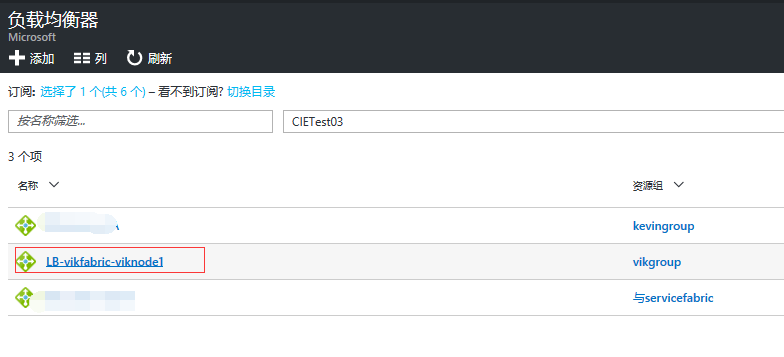
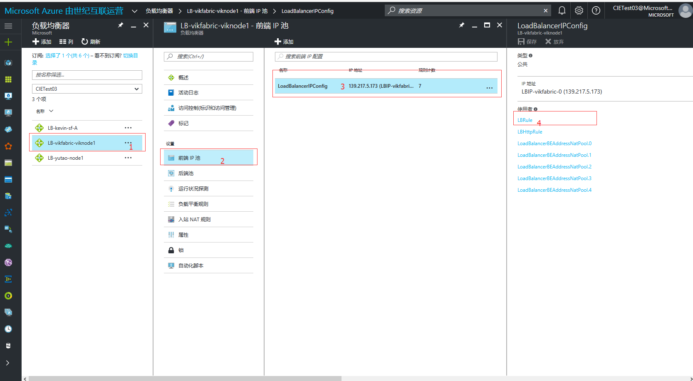
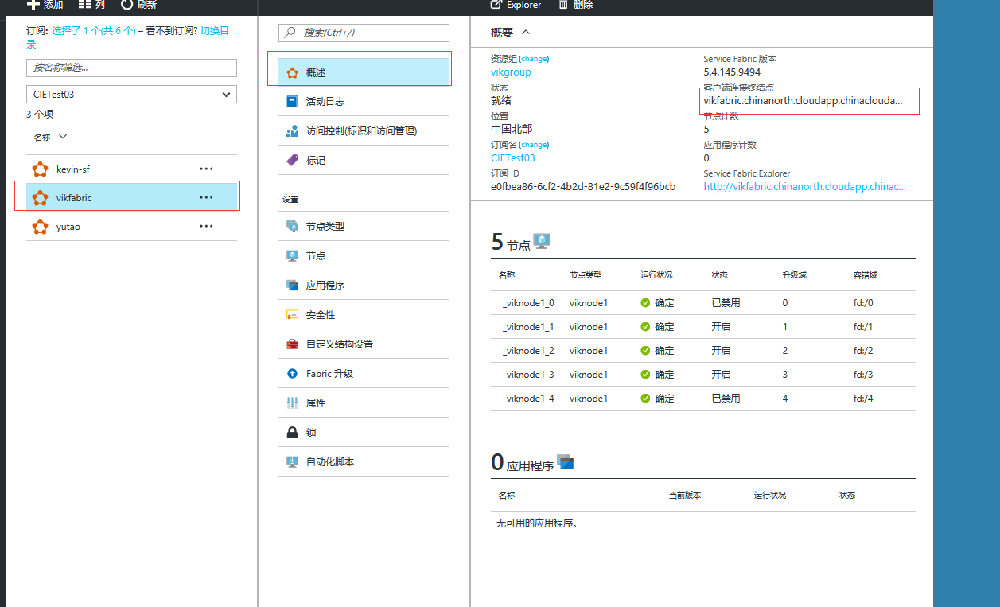

# Service Fabric 部署程序后外网如何访问

Services Fabric 部署程序后如何进行配置以使外网可以访问？

## 前提

1. 创建了Service Fabric。
2. VS 中创建一个 Service Fabric API 程序。

## 步骤

Service Fabric 外网访问需要您开通对应的端口。 
如果您在程序中指定的端口为 : `8237` 。

那么在您部署完程序以后节点的端口也会变为 `8237`。 
打开外部访问端口步骤如下 :

1. 登陆管理门户选择负载均衡，并选中您创建的负载均衡器。

    此处我所创建的 Service Fabric 名称为 `vikfabric` 节点名称为 `viknode`。
    负载均衡器名称为下图 :

    

2. 点击名称并选择“前端 IP 池”并选择 “LoadBalancerIPConfic” :

    

3. 在 LBRule 中添加后端 `8237` 端口并保存 :

    

4. 进入到 Service Fabric 概述中可以看到客户端连接终结点并复制 :

    

5. 在浏览器中打开并在后面添加上您的参数即可。

    http://vikfabric.chinanorth.cloudapp.chinacloudapi.cn/