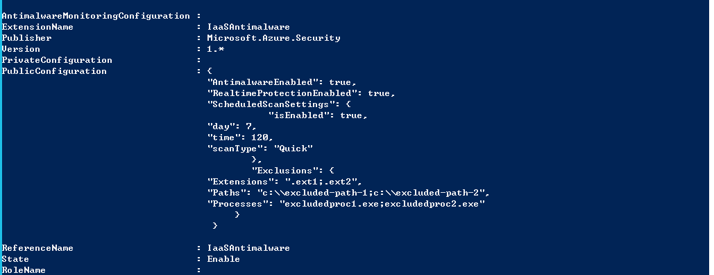
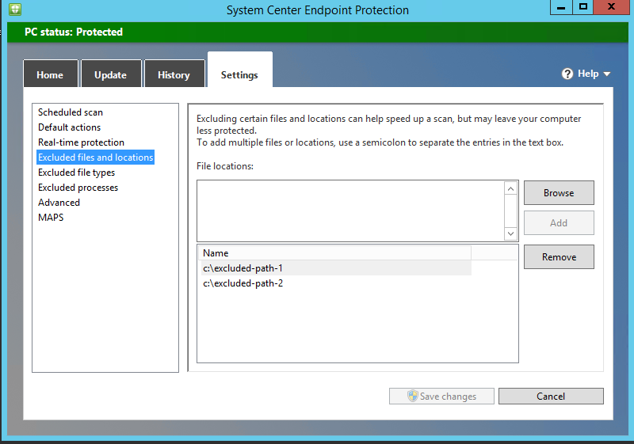

# Azure 虚拟机如何配置 AntiMalware

本文仅演示通过 PowerShell 方式安装并配置 AntiMalware 的过程。

## 经典虚拟机

- 加载 Antimalware 扩展 :

    ```
    $vm = Get-AzureVM -ServiceName yourservicename -Name yourvmname
    Set-AzureVMExtension -Publisher Microsoft.Azure.Security -ExtensionName IaaSAntimalware -Version 1.3 -VM $vm.VM |Update-AzureVM
    ```

    此时虚拟机已经安装过 Antimalware 扩展，官方推荐使用配置文件的方式进行配置（更多的配置定义请参考后续的“[配置字段说明](#configuration)”）

- 配置样例 :

    Json:

    ```
    {
        "AntimalwareEnabled": true,
        "RealtimeProtectionEnabled": true,
        "ScheduledScanSettings": {
                "isEnabled": true,
        "day": 7,
        "time": 120,
        "scanType": "Quick"
                },
                "Exclusions": {
        "Extensions": ".ext1;.ext2",
        "Paths": "c:\\excluded-path-1;c:\\excluded-path-2",
        "Processes": "excludedproc1.exe;excludedproc2.exe"
            }
    }
    ```

    XML:

    ```
    <AntimalwareConfig>
        <AntimalwareEnabled>true</AntimalwareEnabled> 
        <RealtimeProtectionEnabled>true</RealtimeProtectionEnabled>     
        <ScheduledScanSettings isEnabled="true" day="7" time="120" scanType="Quick"/> 
        <Exclusions>
            <Extensions>
                <Extension>.ext1</Extension>
                <Extension>.ext2</Extension>
            </Extensions>
            <Paths>
                <Path>c:\excluded-path-1</Path>
                <Path>c:\excluded-path-2</Path>
            </Paths>
            <Processes>
                <Process>excludedproc1.exe</Process>
                <Process>excludedproc2.exe</Process>
            </Processes>
        </Exclusions>
        <Monitoring>ON</Monitoring>
        <StorageAccountName>contosostorage</StorageAccountName>
    </AntimalwareConfig>
    ```

- 操作步骤：

1. 创建一个配置文件 `D:\anti.json`（本文以 Json 为例）。

2. 执行 PowerShell 命令 :

    ```
    Get-AzureVM -ServiceName yourservicename -Name yourvmname | Set-AzureVMMicrosoftAntimalwareExtension -AntimalwareConfigFile 'D:\anti.json' | Update-AzureVM
    ```

3. 执行成功后，可以获取一下当前虚拟机的 Antimalware 的配置 :

    ```
    Get-AzureVM -ServiceName yourservicename -Name yourvmname | get-AzureVMMicrosoftAntimalwareExtension
    ```

    

    或通过登录到虚拟机内部查看配置 :

    

## ARM虚拟机

- 加载 Antimalware 扩展

    ```
    #通过 PowerShell 加载 Antimalware 扩展，应该至少先定义一个 Antimalware 启动的配置否则无法加载成功
    ############################################################################
    $SettingsString=@{"AntimalwareEnabled" = "true"}

    Set-AzureRmVMExtension -Publisher Microsoft.Azure.Security -ExtensionType IaaSAntimalware -ResourceGroupName yourgroupname  -VMName youvmname -Name IaaSAntimalware -TypeHandlerVersion 1.3 -Location chinanorth -Settings $SettingsString
    ```

## <a id=configuration></a>配置字段说明


## 关于无法在虚拟机内部打开 System Center Endpoint Protection 界面并报错 :


进入指定目录执行以下命令 :

```
C:\Program Files\Microsoft Security Client>ConfigSecurityPolicy.exe cleanuppolicy.xml
```

## 关于如何获取最新的 ARM 虚拟机 Antimalware 镜像扩展信息的方法 : 

```
#确认最新的 Antimalware 服务发布者的名称（有的时候这个名字会因为平台的更新改变）
####################################################
Get-AzureRmVMImagePublisher -Location chinanorth
```


```
#获取镜像类型信息
###################################################
Get-AzureRmVMExtensionImageType -PublisherName Microsoft.Azure.Security -Location chinanorth 
```


```
#获取镜像版本信息
####################################################
$PublisherName = 'Microsoft.Azure.Security'
$PublisherType = 'IaaSAntimalware'
$Location = 'chinanorth'
$Publisher = Get-AzureRmVMExtensionImage -PublisherName $PublisherName -Type $PublisherType -Location $Location 
$Version = $Publisher.Version.Substring(0,3) 
$Version
```

